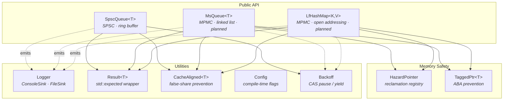
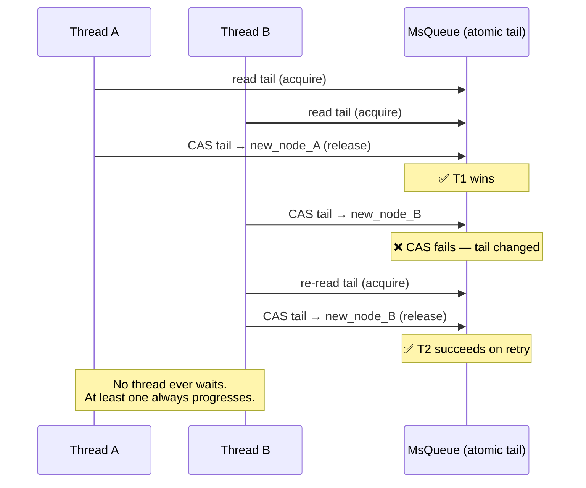
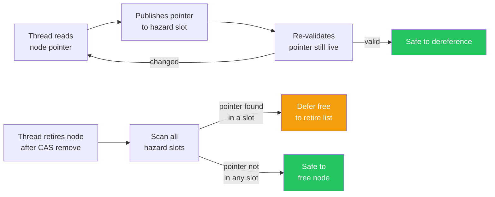

<div align="center">

<pre>
 ██████╗ ██╗   ██╗ █████╗ ██████╗ ██╗  ██╗
██╔═══██╗██║   ██║██╔══██╗██╔══██╗██║ ██╔╝
██║   ██║██║   ██║███████║██████╔╝█████╔╝
██║▄▄ ██║██║   ██║██╔══██║██╔══██╗██╔═██╗
╚██████╔╝╚██████╔╝██║  ██║██║  ██║██║  ██╗
 ╚══▀▀═╝  ╚═════╝ ╚═╝  ╚═╝╚═╝  ╚═╝╚═╝  ╚═╝
</pre>

**Header-only C++23 lock-free concurrency**

[](https://github.com/salgue441/quark/actions/workflows/ci.yml)
[](https://en.cppreference.com/w/cpp/23)
[](LICENSE)
[](#building)

No mutexes. No blocking. System-wide progress under contention.

</div>

---

## Why Quark

Quark is a **header-only** C++23 library for lock-free concurrent data structures. Threads never wait on locks — they **retry** with precise memory orderings, ABA-safe tagged pointers, and hazard-pointer reclamation.

| Guarantees | Mechanism |
|---|---|
| Progress | Lock-free CAS loops (at least one thread advances) |
| ABA safety | `TaggedPtr` version tags in unused pointer bits |
| Reclamation | Hazard pointers (Michael, 2004) |
| Errors | `std::expected` / `quark::Result<T>` — no exceptions |

---

## Status

**In tree today:** memory safety primitives, core utilities, and `SpscQueue`.

| Structure | Producers | Consumers | ABA-safe | Status |
|---|---|---|---|---|
| `quark::SpscQueue<T>` | 1 | 1 | N/A | In tree — ring buffer |
| `quark::MsQueue<T>` | N | N | Yes | Planned — Michael-Scott (1996) |
| `quark::LfHashMap<K,V>` | N | N | Yes | Planned — open addressing |

---

## Architecture

Design rules for containers and memory orders: [docs/DESIGN.md](docs/DESIGN.md)



### Lock-free CAS model



### Hazard pointers



---

## Quick start

```cpp
#include <quark/core/error.hpp>
#include <quark/util/log.hpp>

int main() {
    using namespace quark::log;
    Logger::instance().add_sink(std::make_shared<ConsoleSink>(true));
    Logger::instance().set_level(Level::Debug);

    quark::Result<int> value = quark::Ok(42);
    if (value) {
        QUARK_INFO("Got: {}", *value);
    } else {
        QUARK_ERROR("Failed: {}", value.error().message);
    }
}
```

Umbrella include (convenient, heavier):

```cpp
#include <quark/quark.hpp>
```

### Error handling

```cpp
quark::Result<int> val = /* ... */;

if (!val)
    return quark::Err<int>(val.error().code);

auto doubled = val
    .transform([](int x) { return x * 2; })
    .value_or(0);
```

---

## Layout

```
include/quark/
├── quark.hpp                 Umbrella
├── core/                     Version, config, Result, CacheAligned
├── memory/                   TaggedPtr, HazardDomain
└── util/                     Log, bench, assert, backoff
tests/                        Unit / stress harnesses
cmake/                        Catch2, Benchmark, package config
Dockerfile                    Multi-stage CI image
.github/workflows/ci.yml      Linux · macOS · Windows + Docker
```

---

## Building

**Requirements:** CMake 3.25+, C++23 (GCC 13+, Clang 17+, MSVC 19.40+ / VS 2022)

```bash
cmake -B build -DCMAKE_BUILD_TYPE=Release
cmake --build build
ctest --test-dir build --output-on-failure
```

| Flag | Default | Description |
|---|---|---|
| `QUARK_LOGGING` | `ON` | Structured logging macros |
| `QUARK_BUILD_TESTS` | `ON` | Build / register tests |
| `QUARK_BUILD_BENCH` | `OFF` | Google Benchmark harness |
| `QUARK_SANITIZER` | empty | `address` · `thread` · `undefined` |

### Docker

Optimized multi-stage build (BuildKit cache mounts):

```bash
docker build --target test -t quark:test .
```

Compose helper:

```bash
docker compose run --rm test
```

---

## Design notes

Tradeoff write-ups will land in [`docs/DESIGN.md`](docs/DESIGN.md):

- `acquire` / `release` vs `seq_cst` on the hot path
- Tagged pointers vs epoch-based reclamation for ABA
- False sharing and `CacheAligned<T>` on SPSC head/tail
- Fixed-size hash maps and what resize would require

---

## References

- Michael, M. M. & Scott, M. L. (1996). *Simple, Fast, and Practical Non-Blocking and Blocking Concurrent Queue Algorithms.* PODC.
- Herlihy, M. & Shavit, N. (2008). *The Art of Multiprocessor Programming.* Kaufmann.
- Shalev, O. & Shavit, N. (2006). *Split-Ordered Lists: Lock-Free Extensible Hash Tables.* JACM.
- Michael, M. M. (2004). *Hazard Pointers: Safe Memory Reclamation for Lock-Free Objects.* IEEE TPDS.

---

## License

MIT © Carlos — see [LICENSE](LICENSE)
