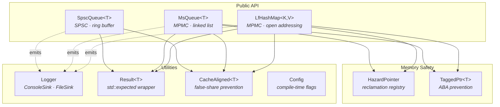
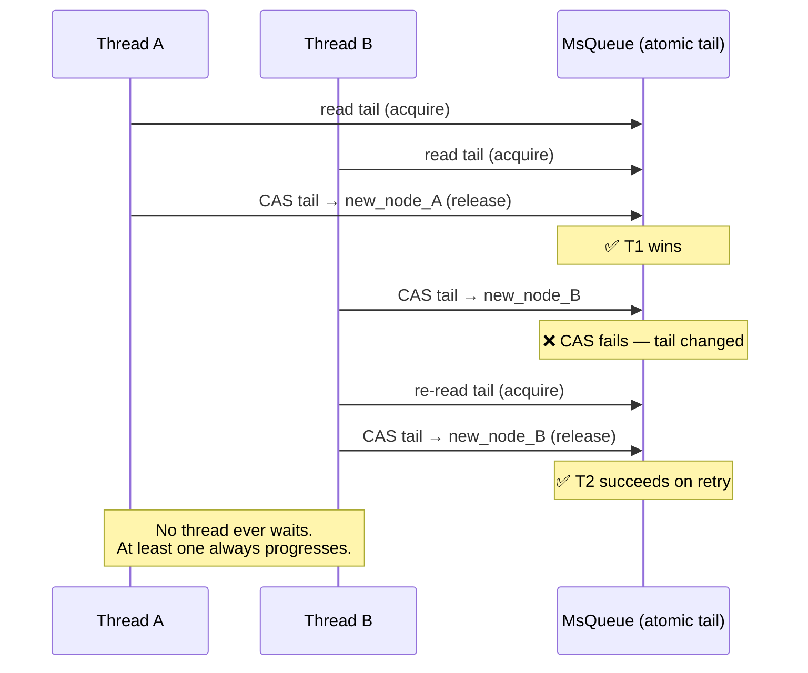
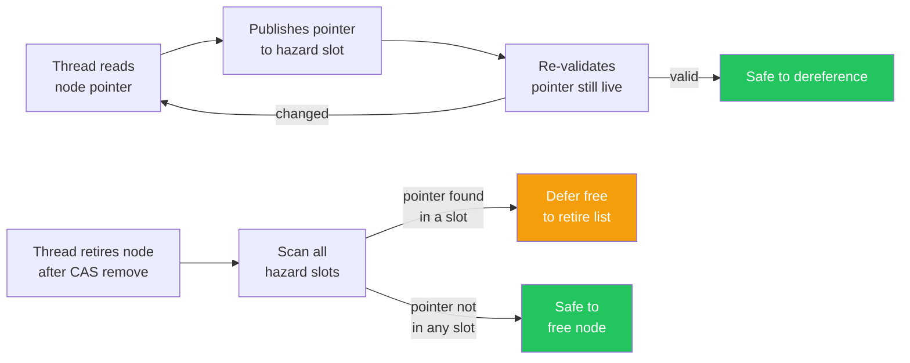

<div align="center">

# ⚛️ Quark

**Modern C++23 lock-free concurrent data structures**

[](https://en.cppreference.com/w/cpp/23)
[](LICENSE)
[]()
[]()

*Lightweight. Non-blocking. Always progressing.*

</div>

---

## Overview

**Quark** is a header-only C++23 library of lock-free concurrent data structures. Every operation is guaranteed to make system-wide progress without relying on mutexes — threads never block each other, only retry on contention.

Built to demonstrate production-grade systems engineering: atomic memory ordering, ABA prevention via tagged pointers, hazard-pointer–based memory reclamation, and a `std::expected`-based error model with zero exceptions.

---

## Features

- **Lock-free, not just mutex-free** — uses `std::atomic` CAS loops with precise memory orderings
- **ABA-safe** — tagged pointers with version counters on all pointer-chasing structures
- **Safe memory reclamation** — hazard pointer implementation prevents use-after-free
- **`std::expected` error handling** — Rust-style `Result<T>` throughout, no exceptions thrown
- **Cache-line aware** — `CacheAligned<T>` wrapper prevents false sharing on hot paths
- **Structured logging** — multi-sink logger (console + rotating file) with zero-cost level filtering
- **Header-only** — drop the `include/` folder into any project

---

## Data Structures

| Structure | Producers | Consumers | ABA-safe | Notes |
|---|---|---|---|---|
| `Quark::SpscQueue<T>` | 1 | 1 | N/A | Ring buffer; highest throughput |
| `Quark::MsQueue<T>` | N | N | ✅ | Michael-Scott queue (1996) |
| `Quark::LfHashMap<K,V>` | N | N | ✅ | Fixed-size open-addressing |

---

## Architecture



---

## Lock-Free Operation Model



---

## Memory Reclamation (Hazard Pointers)



---

## Quick Start

```cpp
#include <Quark/ms_queue.hpp>
#include <Quark/log.hpp>

int main() {
    // Set up logging
    using namespace Quark::log;
    Logger::instance().add_sink(std::make_shared<ConsoleSink>(/*color=*/true));
    Logger::instance().set_level(Level::Debug);

    // Create a lock-free queue
    Quark::MsQueue<int> queue;

    // Push — returns Result<void>
    if (auto r = queue.push(42); !r) {
        LF_ERROR("Push failed: {}", r.error().message);
    }

    // Pop — returns Result<int>
    auto result = queue.pop();
    if (result) {
        LF_INFO("Popped: {}", *result);
    } else if (result.error().code == Quark::Error::QueueEmpty) {
        LF_DEBUG("Queue was empty");
    }
}
```

---

## Error Handling

Quark uses `std::expected` (C++23) throughout — no exceptions, no error codes, no nulls.

```cpp
// Result<T> = std::expected<T, Quark::ErrorInfo>
Quark::Result<int> val = queue.pop();

// Pattern 1 — early return
if (!val) return Quark::Err<int>(val.error().code);

// Pattern 2 — monadic chaining (C++23)
auto doubled = queue.pop()
    .transform([](int x) { return x * 2; })
    .value_or(0);

// Pattern 3 — exhaustive check
switch (val.error().code) {
    case Quark::Error::QueueEmpty:      /* ... */ break;
    case Quark::Error::AllocationFailed: /* ... */ break;
    default: break;
}
```

---

## Project Structure

```
Quark/
├── include/Quark/
│   ├── error.hpp           # Result<T>, Error enum, Ok/Err helpers
│   ├── log.hpp             # Logger, ConsoleSink, FileSink (rotating)
│   ├── arch.hpp            # CacheAligned<T>, CACHE_LINE constant
│   ├── bench.hpp           # ScopedTimer, LF_TIMED macro
│   ├── config.hpp          # Compile-time feature flags
│   ├── tagged_ptr.hpp      # ABA-safe pointer wrapper
│   ├── hazard_pointer.hpp  # Memory reclamation
│   ├── spsc_queue.hpp      # Single-producer single-consumer ring buffer
│   ├── ms_queue.hpp        # Michael-Scott MPMC queue
│   └── lf_hashmap.hpp      # Lock-free open-addressing hash map
├── bench/
│   └── bench_main.cpp      # Google Benchmark harness
├── tests/
│   ├── test_spsc.cpp
│   ├── test_ms_queue.cpp
│   ├── test_lf_hashmap.cpp
│   └── stress_test.cpp     # Randomized concurrent torture test
├── docs/
│   └── DESIGN.md           # Tradeoff analysis — memory orderings, ABA, reclamation
├── CMakeLists.txt
└── README.md
```

---

## Building

**Requirements:** GCC 13+ or Clang 17+, CMake 3.25+

```bash
git clone https://github.com/youruser/Quark.git
cd Quark
cmake -B build -DCMAKE_BUILD_TYPE=Release
cmake --build build

# Run tests
ctest --test-dir build --output-on-failure

# Run benchmarks
./build/bench/Quark_bench
```

**Optional flags:**

| Flag | Default | Description |
|---|---|---|
| `-DQuark_LOGGING=ON` | `ON` | Enable structured logging |
| `-DQuark_BUILD_TESTS=ON` | `ON` | Build test suite |
| `-DQuark_BUILD_BENCH=OFF` | `OFF` | Build Google Benchmark harness |
| `-DQuark_SANITIZE=OFF` | `OFF` | Enable ThreadSanitizer + AddressSanitizer |

---

## Design Notes

Full tradeoff analysis in [`docs/DESIGN.md`](docs/DESIGN.md). Topics covered:

- Why `acquire`/`release` instead of `seq_cst` in the hot path
- ABA problem: why tagged pointers were chosen over epoch-based reclamation
- False sharing: profiling before and after `CacheAligned<T>` on SPSC head/tail
- Why the hash map is fixed-size and what it would take to make it resizable

---

## References

- Michael, M. M. & Scott, M. L. (1996). *Simple, Fast, and Practical Non-Blocking and Blocking Concurrent Queue Algorithms.* PODC.
- Herlihy, M. & Shavit, N. (2008). *The Art of Multiprocessor Programming.* Morgan Kaufmann.
- Shalev, O. & Shavit, N. (2006). *Split-Ordered Lists: Lock-Free Extensible Hash Tables.* JACM.
- Michael, M. M. (2004). *Hazard Pointers: Safe Memory Reclamation for Lock-Free Objects.* IEEE TPDS.

---

## License

MIT © Carlos — see [LICENSE](LICENSE)
